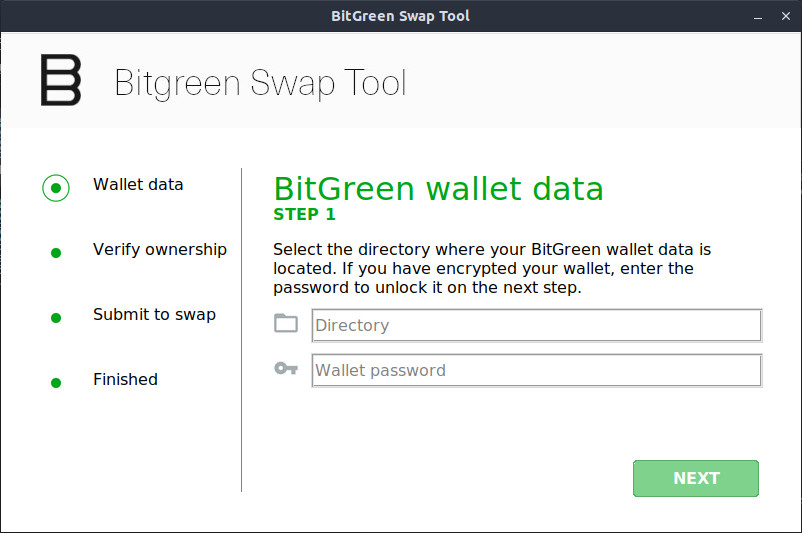

#### Preview


### Checking application authenticity
Always check the authenticity of any application you are downloading over the internet. By utilizing the following commands, you are ensuring the application you have downloaded hasn't been modified/tampered and should match the values below.

**Windows:** `certutil -hashfile bitgreen-swap-tool.exe`
```
SHA1 hash of bitgreen-swap-tool.exe:
e92bf3f7334a17cb37b7c0e07a30c573ee7d1e7e
CertUtil: -hashfile command completed successfully.
```

**Mac OS:** `shasum -a 1 bitgreen-swap-tool`
```
d6845367e8179ee67af95ac6f8872af1dc35ccb3  bitgreen-swap-tool-MacOSX.zip
```

---


### Prerequisites
[Python 3.8.5](https://www.python.org/downloads/release/python-385/)

##### Windows
`pip3 install bsddb3-6.2.9-cp38-cp38-win_amd64.whl` https://www.lfd.uci.edu/~gohlke/pythonlibs/#bsddb3  
`pip3 install requests pillow tkmacosx pyinstaller walletlib ecdsa mnemonic bip32utils python-dotenv`

#### Mac OS
`python3 -m easy_install bsddb3`  
`pip3 install requests pillow tkmacosx pyinstaller walletlib ecdsa mnemonic bip32utils python-dotenv`

##### __Ubuntu 20.04+__
`sudo apt install python3-pip python3-tk python3-pil.imagetk`  
`pip3 install requests pillow tkmacosx pyinstaller walletlib ecdsa mnemonic bip32utils python-dotenv`

## Setup .env
Copy `.env.example` to `.env` and edit env variables.

### Local testing
When testing locally, move contents inside /img into the root folder of main.py before invoking `python3 main.py` or `py .\main.py` for windows user.

### PyInstaller - building standalone application (Windows, Linux, Mac OS)
Windows:  
```pyinstaller --onefile main.py --add-data "img\*.jpg;." --add-data "img\*.ico;." --noconsole --icon=img\favicon.ico --add-data="coincurve\*.dll;coincurve/"  -n bitgreen-swap-tool --clean```  

```Set-AuthenticodeSignature -FilePath bitgreen-swap-tool.exe -Certificate (Get-ChildItem Cert:\LocalMachine\My)[1] -Verbose```

Ubuntu:  
```pyinstaller --onefile main.py --add-data "img/*.jpg:." --noconsole -n bitgreen-swap-tool --clean --hidden-import='PIL._tkinter_finder'```

Mac OS:  
```python3 -m PyInstaller --onefile main.py --add-data "img/*.jpg:." --add-data "img/*.ico:." --add-data ".env:." --noconsole --icon=img/favicon.ico -n bitgreen-swap-tool --clean```